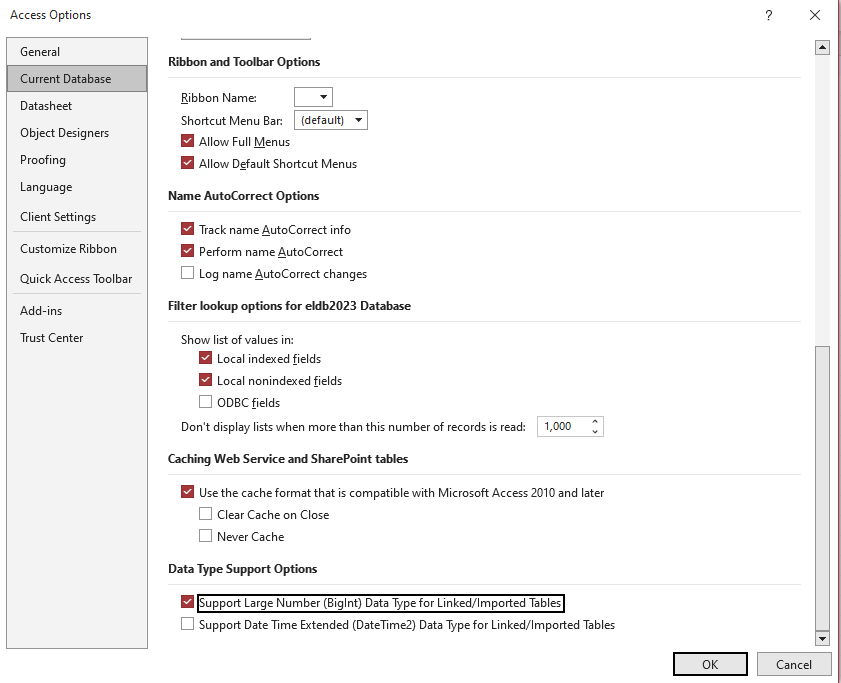
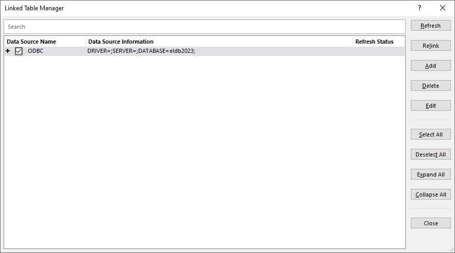

# Microsoft Access
## Microsoft Access Overview

Microsoft Access is a database application available within the Microsoft Office suite. It can link to tables within an East London Database using an ODBC driver within a user DSN. This should be setup to not download or copy the data to your device.

Whilst it is possible to host multiple connections within a single MS Access file, this could be cumbersome. We have found that queries joining tables from two databases run extremely slowly or never finishing at all. At the moment, therefore, cross database/year analysis is not possible. Our recommendation is to create separate MS Access database files for each database/year.

## ODBC Driver and User DSN
Before continuing with this setup, make sure you have completed the [ODBC driver setup](ODBC_DSN.md) and created a User DSN on your laptop or PC.

## Connect MS Access to the ELDB Server
Create a new Access database within a secure location.
In the new Access database, select to connect to a SQL Server or ODBC data source. Different versions of MS Access do this slightly differently. For instance:
	Select External Data > From Database > SQL Server.
	Select External Data > New Data Source > From Other Sources > ODBC Database.
Select Link the data source by creating a linked table and select OK.
In the Pop Up, select the Machine Data Source tab and then select the DSN that you created for the ELDB Server.
Click OK.

In the SQL Server Login Pop Up, enter your password.

Click Options >> to display the additional settings

Set Database to the ELDB database that you wish to connect to eg eldb2022

An Option is also provided to change your password, if needed.

Click OK

In the Link Tables dialog box, select each ELDB table with which you wish to link. ELDB tables and views are prefixed with dbo. Do not select any of the system tables (information_schema., sys.).

Each table has to be select one by one, using a mouse click or spacebar and arrow keys.

> [!tip]
> Only link to the tables you need as you can add other later (see [Adding tables via DSN](#Adding tables via DSN))
> Link to `db_tables` to have a list of all tables in the database.

Click OK.

A popup will warn that the table contains BigInt data type. Click Yes.

A second popup will warn that a data type is not backwards compatible. Click OK

This is required to stop the #Deleted error (see below).

The linked tables will appear in the Access left hand pane.

### Ticking Save Password

The Link Tables popup has a Save password option.

The recommendation is to NOT tick to Save the password.

Ticking this option means that you will not have to provide a password each time you use the database. However, the password is not encrypted and is saved within the file. A popup with this information will require clicking for every linked table ie if you select to link 80 tables, you will need to click a Save Password prompt 80 times.

### #Deleted Error

The ELDB database uses a datatype of ‘bigint’, which is not recognised as standard by Access and requires a change in the settings. Without this change, the ELDB data will be displayed as ‘#Deleted’.

Changing the setting can either be done during the table linking, described above, or via the Access settings.

Select _File > Options > Current Database_

Scroll down to _Data Type Support Options_

Tick ‘Support Large Number (BigInt) Data Type for Linked/Imported Tables’ and OK

A popup will warn you that must open and close the database. Click OK and reopen the database.

## Removing the dbo_ prefix

The linked tables appear in Access with a schema prefix (`dbo_`). This can be removed by running a Visual Basic script provided by CEG. 

Download the [VB_remove_dbo.bas](https://www.qmul.ac.uk/ceg/media/ceg/documents/Visual-Basic-Script-for-MS-Access.zip)  script to your laptop or PC.

Within the Access database, open the Visual Basic module. This may be accessed in different ways depending on your version of MS Access. For instance: Database Tools > Visual Basic

Select _File > Import File_ and select the VB_remove_dbo.bas file. Click Open.

Select _Run > Run Macro_ and Run the *TruncateDBO* macro.

Click OK to clear the message box.

Close the Visual Basic module.

It can take a couple of minutes for the table list to refresh, without the `dbo_` prefix.

## Adding Additional Linked Tables

The DSN links MS Access to the tables and views specified in the Linked Tables dialogue.  New tables need to be manually added to make them available within MS Access.  Similarly, changes to the SQL Server tables requires a manual refresh for the MS Access view to be updated.
### Adding tables via DSN
Reconnect your Access database to your ODBC DSN by following the steps for [Connect MS Access to the ELDB Server](#Connect MS Access to the ELDB Server).
At the Link Tables dialog box, select the additional tables with which you wish to link.   
Click OK.
As before, click Yes and OK to accept the BigInt datatype
### Refreshing tables via Linked Table Manager
Select External Data > Linked Table Manager
Expand the Data Source Name (click on the “+” sign) and select all by selecting the ODBC checkbox. 
OR alternatively, you can select the specific table(s) that you know need refreshing.

On the right-hand side of the window, click on “Refresh”.
The refresh may take a few seconds

> [!tip]
> Refresh your MS Access tables every month to ensure your database reflects any new items or amendments. We issue a monthly newsletter to East London Database users, which includes a list of any specific changes.
