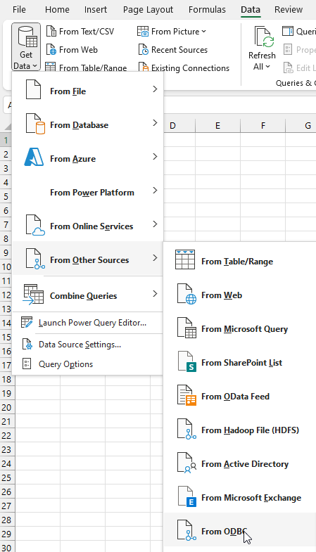
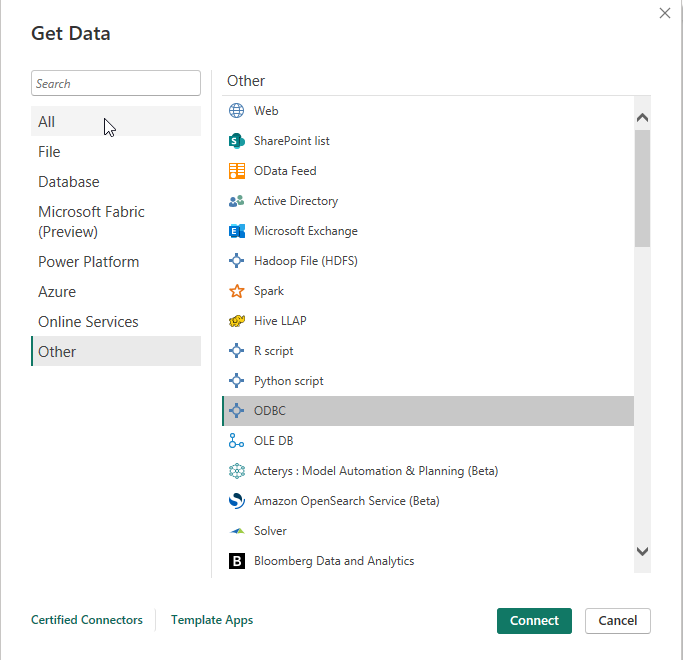

# Power Query
## Power Query Overview
Power Query is a data preparation application integrated into many of Microsoft data products, most notably Excel 2016+ and Power BI. Similar to Microsoft Access, it is possible to link tables within an East London Database using an ODBC driver within a user DSN. This should be setup to not download or copy the data to your device.
## ODBC Driver and User DSN
Before continuing with this setup, make sure you have completed the [ODBC driver setup](ODBC_DSN.md) and created a User DSN on your laptop or PC.

## Switch Off Data Load
By default, Power Query will load the entire data connection, in this case an ELDB table, into the memory of its data model or into the Excel workbook. As some tables are millions of rows in size, this can take up a lot of memory and cause your application or device to slow down or even crash. It can also contravenes the CEG Data Policy that whole tables should not be downloaded to a local machine. It is important, therefore, to switch off this default setting.
## Excel
Go to _Get Data_ and select _Query Options_.
Under Global, select _Data Load_ and change the Default Query Load Settings to _Specify custom default load setting_.
Make sure _Load to worksheet_ and _Load to Data Model_ are unticked. Click OK.

## Power BI
Power BI does not have a global data load setting and some this must be managed for each linked table. When selecting a linked table from the Navigator (see below), do not choose to Load the data. Select _Transform Data_ to open the Power Query window, with the selected data links (queries). Right click on a query and untick _Enable Load_.

## Connecting with Excel / Power BI
Both Excel and Power BI use a similar GUI for external data connections.  
Select an ODBC connection:
> [!note]- Excel
> Go to _Get Data_ >>  _From Other Source_s >> _From ODBC_.
>  

> [!note]- Power BI
> Go to _Get Data_ >>  _More… >> Other_ >> _ODBC_, and click Connect.
>  |

In the _From ODBC_ pop up, select the name of the DSN you created and OK.

Select _Link the data source by creating a linked table_ and select OK.

If required, provide your ELDB Server username and password.

In the Navigator window, select the table(s) you wish to link and click _Transform Data_ to open the Power Query window, with the selected data links, for further querying.