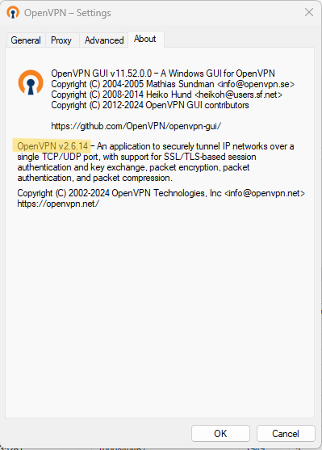

# Setting Up CEG-VPN Access
## Download your zip file
You should have received an email containing a URL link to download a zip file containing your CEG-VPN3 login details.  This is sensitive information, so save it to your secured home location in your .ssh folder or a dedicated OpenVPN folder. For instance:  
*C:\Users\{USERNAME}\OpenVPN*  
*C:\Users\{USERNAME}\.ssh*  
*/Users/{USERNAME}/.ssh*  
*/Users/{USERNAME}/OpenVPN*  

The URL is only live for 48 hours, so please download the file as soon as possible.  If you miss the deadline contact me to generate another URL for you.

The zip file contains the following files:

- **auth.txt** -- your VPN username and password
- **{USERNAME}.png** -- your OTP QR code
- **{USERNAME}.ovpn** -- your VPN config file containing the necessary keys
- **{USERNAME}** -- (no file extension) additional OTP information

These files will enable you to setup a connection to the CEG-VPN3 using a VPN client (OpenVPN Client or Tunnelblick) + authentication using an OTP authorisation phone app (eg 2FAS, Microsoft Authenticator, Authy etc).  This is slightly different to the Duo Mobile 'PUSH' method that was used for CEG-VPN2, but will probably be familiar from other OTP authorisations.

## Setup your OTP authenticator
You will need an [OTP Authenticator](../Connection/Required_Software.md/#OTP-Authenticator) installed on your smart phone.  In your OTP app:

- Open the {USERNAME}.png file to display the QR code.
- Follow the instructions specific to your OTP Authenticator app to add a new account or service using the QR code.
- Skip any step that asks you to retype the displayed number.
- If wanted, edit the account or service name to a better description, eg "CEG-VPN3"

## Setup your VPN client
You will need a [VPN Client](../Connection/Required_Software.md/#VPN-Client) installed on your laptop or PC.

### OpenVPN GUI
#### Ensure that your OpenVPN GUI client is using OpenVPN v2.6
- Right-click on the OpenVPN GUI try icon and go to *Settings* and the *About* tab.
- Half way down the tab is the OpenVPN information, eg "OpenVPN v2.6.13"
	- If needed, download and install the latest version

#### Import your ovpn file into OpenVPN GUI
- Right-click on the OpenVPN try icon and select *Import File*.
- Browse to your ovpn file and click *Open*.
- OK the popup message.
- If you are updating the ovpn file, OK the warning that you are overwriting an existing file.
#### First-time connect to CEG-VPN3
- Right-click the OpenVPN tray icon and click *Connect*.
- A window will appear displaying connection information.
  - In the authentication window:
    - Enter your username (from the auth.txt file) into *Username*
    - Enter your password (from the auth.txt file) into *Password*
      - Tick *Save Password*
    - Enter the current code displayed in your OTP Authenticator into *Response*
    - Click *OK*
  - In the second authentication window:
    - Re-enter your password (from the auth.txt file) into *Password*
      - Tick *Save Password*
    - Click *OK*

### OpenVPN Connect (Windows / Mac)
#### Add your ovpn file as a new profile
- Click on the + and select *Upload File*
- Drag and drop your ovpn file into the OpenVPN Connect window
  - OR click *Browse* and select your ovpn file
#### In the profile details:
- Change 'Profile Name' to something more meaningful, eg "CEG-VPN3"
- Enter your username (from the auth.txt file) into 'Username'
  - Tick 'Save Password'
	- Enter your password (from the auth.txt file) into 'Password'
  - Tick 'Save Private Key Password'
	- Re-enter your password (from the auth.txt file) into 'Private Key Password'
- Click *Profiles*

### Tunnelblick (Mac)
#### Add your ovpn file as a new profile
- Drag and drop your ovpn file onto the Tunnelblick icon.
  - If prompted, install 'only for me'
  - If prompted, agree to use the openvpn-down-root plugin'
#### In the Login Required window:
- Enter your username (from the auth.txt file) into 'Username'
  - Tick 'Save in Keychain'
- Enter your password (from the auth.txt file) into 'Password'
  - Tick 'Save in Keychain'
- Click *OK*
#### In the Authentication popup:
- Enter the current code displayed in your OTP Authenticator into *OTP Code*
- Click *OK*
- In the Passphrase Required window:
- Re-enter your password (from the auth.txt file)
  - Tick 'Save in Keychain'
- Click *OK*

