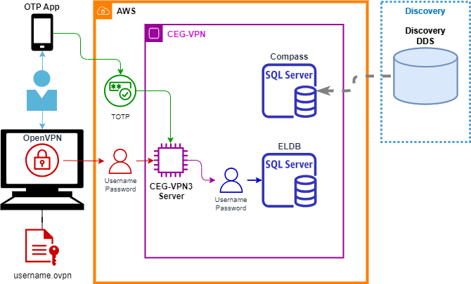

# CEG-VPN & Resources Overview

## CEG-VPN3

The CEG-VPN3 (Virtual Private Network) is a secured network hosted in Amazon Web Services, which is accessible only via a dedicated OpenVPN server.  The VPN contains several CEG resources, most notably Compass - our Discovery subscriber database.

Connection to the OpenVPN server requires the user to have a suitable [VPN client](Required_Software.md#VPN Client) installed on their laptop or PC.  This establishes a secure tunnel between their device and the OpenVPN server using a series of keys and protocols to encrypt the connections and communications.  The user's encryption configuration is provided in a personal `.ovpn` file, which the user imports into the VPN client.

Previous versions of the VPN (CEG-VPN1 and CEG-VPN2) used Duo Mobile to provide 2-Factor Authentication.  CEG-VPN3 instead uses a username, password and TOTP (Time-synchronised One Time PIN) to provide user authentication.  The TOTP is generated from from an [OTP phone app](Required_Software.md#OTP-Authenticator) on the uses phone.   

The encryption used throughout is inline with [NHS Digital](https://digital.nhs.uk/services/gp-connect/develop-gp-connect-services/development/security) and National Cyber Security Centre ([NCSC](https://www.ncsc.gov.uk/guidance/tls-external-facing-services)) guidelines and employs up to date methods and standards.

## CEG Resources
Once a user has connected into the CEG-VPN, they can connect to the CEG resources for which they have login or access credentials.  Each resource has it's own security requirements, which means access to one resource, such as the ELDB server, does not provide access to any other resource.

The ELDB databases, one for each year, are held on the 'ELDB' Microsoft SQL Server.  Access requires a username and password, separate to the CEG-VPN credentials, connecting on the standard SQL Server port 1433.