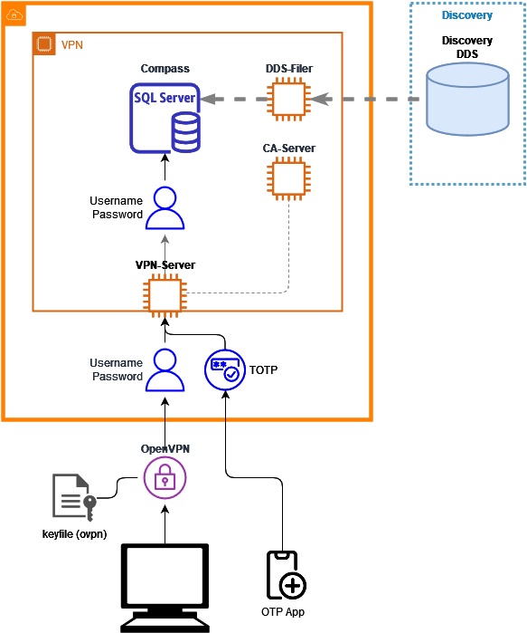

## Links
`[SQL client](../Connection/Clients/SQL_Clients.md)` = [SQL client](../Connection/Clients/SQL_Clients.md)
~> `https://qmul-ceg.github.io/eldb-docs/Connection/Clients/SQL_Clients/`

`[lu_lsoa2021](../Data/Lookup.md#lu_lsoa2021)` = [lu_lsoa2021](../Data/Lookup.md#lu_lsoa2021)
~> `https://qmul-ceg.github.io/eldb-docs/Data/Lookup/#lu_lsoa2021`

From `/Data/Lookup.md`
`[lu_lsoa2021](#lu_lsoa2021)`
~> `https://qmul-ceg.github.io/eldb-docs/Data/Lookup/#lu_lsoa2021`

``

`[SQL client](/Connection/Clients/SQL_Clients.md)`
~> `https://qmul-ceg.github.io/Connection/Clients/SQL_Clients.md` 404

`[[Connection/Clients/SQL_Clients|SQL_Clients]]`
~> `https://qmul-ceg.github.io/eldb-docs/Other/Testing/Connection/Clients/SQL_Clients.md` non-page

For full information see [Analysis: Blood Pressure](../Analysis/Blood_Pressure.md)